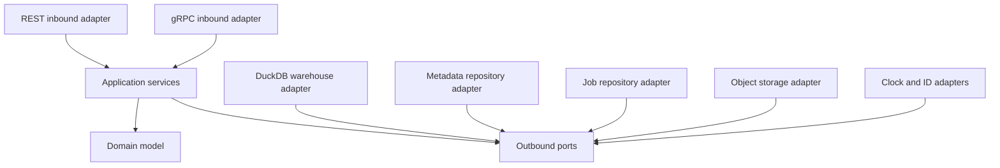
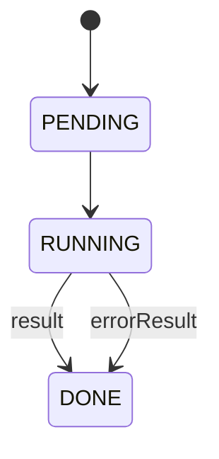

# Architecture

## Goals

1. Reproduce the observable BigQuery contracts used by SDKs, `bq`, and the
   Spark BigQuery connector.
2. Keep the SQL engine, metadata persistence, object storage, clock, and ID
   generation replaceable.
3. Implement one end-to-end behavior at a time, with protocol tests at the
   public edge.
4. Use official protobuf definitions instead of copying generated code.
5. Make semantic differences explicit. Silent approximations are more harmful
   to integration tests than an `UNIMPLEMENTED` response.

Non-goals are implementing a new database, reproducing BigQuery's distributed
execution engine, or claiming production scalability.

## Dependency rule



The arrows show source-code dependencies, not runtime calls. Domain and
application packages never import adapters. Transport packages convert external
wire types to application inputs and domain values.

## Package ownership

| Package | Owns | Must not own |
| --- | --- | --- |
| `internal/domain` | catalog identities, schemas, job state transitions, domain errors | HTTP JSON, protobuf messages, SQL connections |
| `internal/application` | catalog orchestration, job submission/execution, compensation | DuckDB SQL, URL routing, generated wire types |
| `internal/ports` | repository, warehouse, object storage, clock, ID contracts | concrete implementations |
| `internal/adapters/duckdb` | physical schemas, BigQuery-to-DuckDB type mapping, SQL execution | REST resources, job lifecycle |
| `internal/adapters/memory` | thread-safe catalog and job persistence | query execution |
| `internal/adapters/objectstore` | URI-to-object access | load-job state machine |
| `internal/transport/rest` | BigQuery v2 paths, JSON shapes, HTTP error mapping | DuckDB imports |
| `internal/transport/grpc` | official service registration and gRPC status mapping | generated protobuf copies |
| `cmd/emulator` | composition root, listeners, lifecycle, flags | business rules |

Compile-time assertions such as the following fail the build if an adapter no
longer satisfies a port:

```go
var _ ports.Warehouse = (*duckdb.Warehouse)(nil)
var _ ports.CatalogRepository = (*memory.CatalogRepository)(nil)
var _ storagepb.BigQueryReadServer = (*grpcserver.StorageServer)(nil)
```

`internal/application/catalog_test.go` injects a fake warehouse. It is the
regression test for backend replaceability: catalog use cases execute without
linking application behavior to DuckDB.

## Runtime components

The process has two listeners:

- REST on `BQEMU_HTTP_ADDRESS` for health, BigQuery v2, emulator project
  lifecycle, and optional UI assets.
- gRPC on `BQEMU_GRPC_ADDRESS` for BigQuery Storage Read and Write.

Both listeners can terminate TLS using the same certificate. Authentication is
currently permissive; TLS and identity are separate concerns.

The composition root creates:

1. One DuckDB-backed `Warehouse`.
2. One in-memory `CatalogRepository`.
3. One in-memory `JobRepository`.
4. System clock and random ID adapters.
5. Catalog and query application services.
6. REST and gRPC inbound adapters.

## Catalog model and physical naming

BigQuery identifies a table as `project.dataset.table`. DuckDB identifies it as
`schema.table` inside a database. The adapter maps each BigQuery dataset to a
collision-free DuckDB schema:

```text
BigQuery: test-project.analytics.events
DuckDB:   bq_746573742d70726f6a656374_616e616c7974696373.events
```

Both project and dataset bytes are hex encoded. This avoids ambiguity caused by
hyphens, underscores, case, or concatenation. Every emitted identifier is also
double-quoted.

GoogleSQL backtick references are translated only inside the DuckDB adapter:

| Input | Required context | Physical output |
| --- | --- | --- |
| `` `p.d.t` `` | none | encoded `p/d` schema plus `t` |
| `` `d.t` `` | request project | encoded project/`d` plus `t` |
| `` `t` `` | request project and default dataset | encoded schema plus `t` |

The current translator recognizes backtick-delimited table references; it is
not a complete GoogleSQL parser. A semantic SQL adapter must replace it before
claiming compatibility for strings containing backticks, scripts, table
functions, decorators, snapshots, or arbitrary DDL.

## Type ownership

The domain uses BigQuery type names. The DuckDB adapter performs physical type
mapping:

| BigQuery | DuckDB storage | Important note |
| --- | --- | --- |
| `BOOL` | `BOOLEAN` | direct |
| `INT64` | `BIGINT` | direct |
| `FLOAT64` | `DOUBLE` | NaN/Infinity JSON formatting remains work |
| `NUMERIC` | `DECIMAL(38,9)` | compatible width and scale |
| `BIGNUMERIC` | `VARCHAR` | preserves digits; arithmetic is not compatible |
| `STRING` | `VARCHAR` | collation semantics differ |
| `BYTES` | `BLOB` | REST emits base64 |
| `DATE` | `DATE` | direct |
| `DATETIME` | `TIMESTAMP` | no timezone |
| `TIME` | `TIME` | direct within DuckDB precision |
| `TIMESTAMP` | `TIMESTAMPTZ` | normalized instant |
| `JSON` | `JSON` | JSON canonicalization can differ |
| `GEOGRAPHY` | `VARCHAR` | no geography functions yet |
| `RECORD` | `STRUCT` | nested field modes need protocol tests |
| `REPEATED` | `T[]` | represented as a DuckDB list |

Partitioning and clustering are retained in metadata but are not yet physical
storage guarantees. A later adapter may create partition metadata/indexes or
route to another engine without changing domain types.

## Catalog consistency

M0 keeps metadata in memory and data in DuckDB. Create operations use a simple
compensation sequence:

1. Validate the domain resource.
2. Create the physical DuckDB schema/table.
3. Persist metadata.
4. If metadata persistence fails, drop the physical object.

This is not a distributed transaction. Delete currently drops physical storage
before metadata. Process failure between steps can create drift. M1 will put
catalog and job metadata in DuckDB system tables and use one database
transaction where possible.

The intended metadata tables are conceptually:

```text
__bq.projects
__bq.datasets
__bq.tables
__bq.jobs
__bq.read_sessions
__bq.read_streams
__bq.write_streams
__bq.write_offsets
```

The domain interfaces do not assume those table names.

## Job state model



BigQuery uses `DONE` for both success and failure. A client must inspect
`status.errorResult`; state alone is insufficient.

`jobs.query` creates and completes a query job in the request. `jobs.insert`
stores `PENDING`, executes on a background goroutine, and supports polling via
`jobs.get` and `jobs.getQueryResults`. The repository clones job values to
avoid data races between execution and serialization.

Required hardening before parallel workload support:

- bounded worker pool and admission control;
- caller-independent cancellation context with an explicit cancel operation;
- idempotent `jobs.insert` behavior for user-supplied job IDs;
- pagination and result retention;
- durable terminal state;
- per-project and per-location indexes.

## Query execution

M0 classifies row-returning statements and uses `database/sql`:

- `SELECT`, `WITH`, `VALUES`, `SHOW`, `DESCRIBE`, `EXPLAIN`, and `PRAGMA` use
  `QueryContext` and materialize rows into the job result.
- DDL and DML use `ExecContext` and record `RowsAffected` when available.

This gives a small verified vertical slice, not full GoogleSQL. A future
`SQLDialect` outbound port should own parsing, semantic rewrites, parameter
binding, multi-statement scripts, and BigQuery function emulation.

## Storage Read design

The gRPC service already binds the official generated `BigQueryReadServer`.
Implementation should be added as a vertical slice with these components:

1. `CreateReadSession` validates `projects/.../datasets/.../tables/...` and
   selected fields/row restriction.
2. Start a DuckDB transaction or snapshot and materialize a stable result with
   a deterministic ordinal column.
3. Serialize one reference schema as Arrow IPC schema or Avro schema.
4. Divide ordinal ranges into the requested number of read streams.
5. Persist session, stream range, schema fingerprint, snapshot, and expiry.
6. `ReadRows` seeks to `range_start + offset` and streams bounded record blocks.
7. `SplitReadStream` splits only an unconsumed range and preserves the union of
   rows without overlap.

A stable staged result is important. Re-running the source query independently
for each stream can duplicate or omit rows if the table changes, and an
unordered `LIMIT/OFFSET` plan is not a stream contract.

Arrow serialization should use Arrow Go IPC payload helpers and send the bare
schema/record-batch bytes required by the BigQuery Storage protobuf fields, not
an entire Arrow file. Avro needs the same golden-wire tests. Test fixtures must
cover null bitmaps, decimals, timestamps, dates, times, nested records,
repeated fields, JSON, empty results, compression, offsets, and multiple
streams.

## Storage Write design

The official `BigQueryWriteServer` is registered. Its implementation should use
a stream ledger behind an outbound repository port:

```text
stream name
destination table
type: DEFAULT | COMMITTED | BUFFERED | PENDING
state: OPEN | FINALIZED | COMMITTED
schema fingerprint
next offset
visible offset
staging relation
created/updated timestamps
```

Protocol invariants:

- offsets are per stream, not global;
- retrying an already accepted `(stream, offset, payload)` is idempotent;
- a gap returns `OUT_OF_RANGE`;
- a different payload at an accepted offset is rejected;
- append responses preserve request order on the bidirectional stream;
- only `PENDING` streams participate in `BatchCommitWriteStreams`;
- one batch commit makes every included pending stream visible atomically;
- finalization fixes the row count and rejects later append operations;
- concurrent streams to the same table are supported.

For DuckDB, each pending stream can stage rows in its own internal table. Batch
commit then runs all destination inserts and ledger transitions in one DuckDB
transaction. A single process-wide SQL connection is adequate for M0 but write
streams need a serialized commit coordinator plus independent decode workers.

## Load-job design

Load is deliberately outside M0, but its boundaries already exist:

- `ObjectStorage` opens a URI without exposing GCS SDK types to application.
- a GCS adapter can target Google Cloud Storage or a fake server;
- a filesystem adapter supports deterministic local fixtures;
- the warehouse adapter ingests Parquet/CSV/JSON/Avro;
- the job service owns dispositions, state, idempotency, and atomic visibility.

The safe flow is:

1. Validate destination, schema, format, dispositions, and source URI list.
2. Resolve every object through `ObjectStorage` into immutable local inputs.
3. Load all files into a staging relation.
4. Validate bad-record thresholds and schema evolution.
5. In one transaction, apply `WRITE_EMPTY`, `WRITE_APPEND`, or
   `WRITE_TRUNCATE`, then mark the job successful.
6. On any error, drop staging and expose no destination changes.

DuckDB supports Parquet directly. Avro support needs a deliberate reader or
extension strategy and cross-format logical-type tests; it must not be treated
as equivalent merely because a file can be opened.

## Authentication boundary

Authentication should be another inbound concern. It must not enter query or
catalog services. Planned modes:

- `disabled`: accept every request for local tests;
- `static`: validate a configured bearer token;
- `oidc`: validate JWT issuer, audience, signature, and time claims;
- `metadata`: expose a test-only metadata/STS surface for ADC and WIF flows.

Service-account keys, user ADC, and WIF differ in token acquisition, but the
BigQuery service receives a bearer token in all three cases. An emulator can
test acquisition flows only by also providing the required metadata/STS/IAM
endpoints or by pointing credentials at a dedicated token stub.

## Public edge and UI

The optional UI never receives privileged domain operations. It uses the same
BigQuery v2 resources as `bq`, SDKs, and tests. `/emulator/v1/console` is only a
discovery document. Project lifecycle is emulator-specific because the
BigQuery API cannot create Google Cloud projects.

Static assets are an inbound adapter detail controlled by `--ui-enabled` and
`--ui-dir`. Keeping this opt-in allows the canonical backend image/package to be
consumed without a frontend and avoids coupling application behavior to asset
build tooling.

## Test strategy

Tests are layered by failure mode:

| Layer | Test | Detects |
| --- | --- | --- |
| Domain | state and schema validation | illegal transitions/invariants |
| Application | fake outbound ports | leaked backend dependency/orchestration errors |
| DuckDB adapter | create/insert/select/MERGE | SQL translation and type mapping regressions |
| REST contract | `httptest` JSON and polling | `bq`/SDK-visible incompatibility |
| gRPC contract | `bufconn` official clients | registration, status, wire contract |
| Future Spark matrix | real connector jars | end-to-end Arrow/Avro/direct/indirect behavior |

Every compatibility claim should have a public-edge test. Backend-only success
is insufficient because BigQuery clients are sensitive to field names, string
encoding of 64-bit values, error reasons, and job polling semantics.
